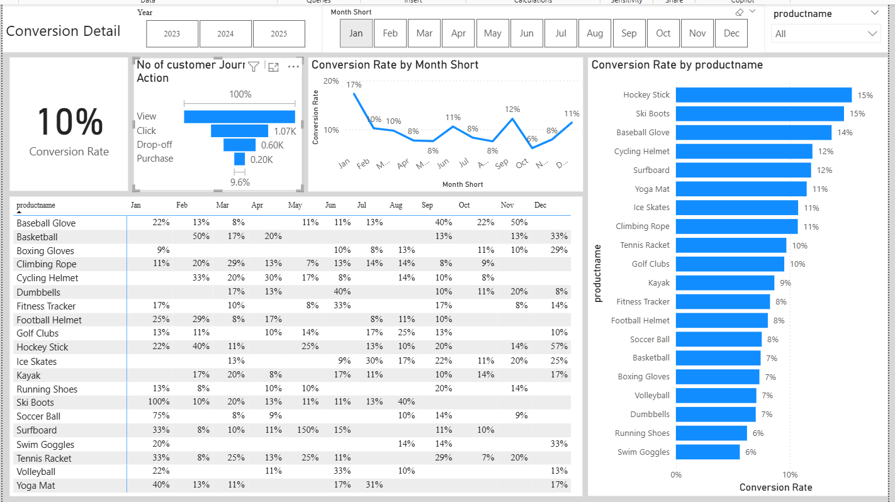

## 🚀 Project Objective

Help marketing and business teams answer critical questions:

- Where are customers dropping off in the conversion funnel?
- Which products drive the highest conversions?
- How is customer engagement trending over time?
- What do customer reviews reveal about satisfaction?
- How can conversion rates and engagement be improved?

---

## 🖥️ Dashboard Preview

### Executive Overview


### Conversion Detail Dashboard


### Social Media Engagement Dashboard


### Customer Sentiment & Review Dashboard


---

## 🧠 Key Business Insights

- Overall conversion rate is **~10%**, indicating opportunity for optimization
- Major drop-offs occur between **View → Click → Purchase stages**
- High-performing products consistently maintain higher conversion rates
- Customer engagement shows declining trends in later months
- Sentiment analysis reveals majority positive reviews, but negative feedback highlights improvement areas
- Average customer rating is **3.69 / 5**, indicating room to improve customer experience

---

## 🛠️ Tools & Technologies

**Database & Querying**
- SQL Server
- SQL (Joins, Window Functions, CTEs, Data Cleaning)

**Data Processing**
- Python
- Pandas
- NLTK (VADER Sentiment Analysis)
- PyODBC

**Business Intelligence**
- Power BI
- DAX Measures
- Power Query
- Star Schema Data Modeling

---

## 📊 Key Skills Demonstrated

- SQL Data Extraction & Transformation
- Customer Funnel Analysis
- Conversion Rate Analysis
- Sentiment Analysis using NLP
- Power BI Dashboard Development
- DAX Measures & KPI Creation
- Business Insight Generation
- Data Modeling (Star Schema)

---

## 🧩 Project Architecture

```
SQL Server → SQL Queries → Python Sentiment Analysis → Power BI Dashboard → Business Insights
```

---

## 📁 Project Structure

```
marketing-analytics-project/
│
├── Data/
├── SQL Queries/
├── Python Script/
├── Power BI/
├── image/
└── README.md
```

---

## 💼 Business Value

This dashboard enables stakeholders to:

- Identify conversion bottlenecks
- Improve marketing strategy
- Optimize product performance
- Monitor customer engagement
- Improve customer satisfaction

---

## 👨‍💻 Author

**Prince Kumar**

Aspiring Data Analyst skilled in SQL, Python, and Power BI, focused on building real-world analytics projects that drive business decisions.

- LinkedIn: https://www.linkedin.com/in/aman-jha-27953624a/


---

⭐ If you found this project useful, feel free to star the repository.
